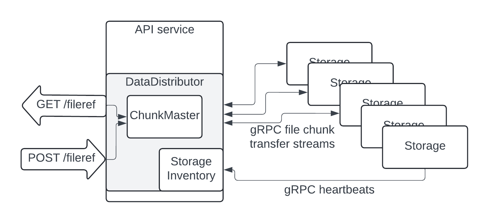

# Distributed Storage

An API-layer service receives REST with a file. Splits the data among X "storage" services.

The same service also can receive a request for getting this file back. Construct it and return.

## Testing instructions

* start containers: run `docker compose -p diststorage up --build` in `docker/` directory
* do `go run testapp.go` in `internal/cmd/testapp`. See that md5s match

## Solution description

Single API service which accepts 2 REST API requests:
1. `POST /{fileref}` to send data. `Content-Length` provides data size for chunk calculation, data itself is passed via a body
2. `GET /{fileref}` to receive back stored data

API service passes all requests to DataDistributor, which can DistributeData and ReconstructData. It employs ChunkMaster which stores information about chunk distribution and does this distribution. DataDistributor has a role of an orchestrator for a distributed chunk-saving transaction and is able to roll it back.

DataDistributor is also an inventory manager for storage services. It receives heartbeats from storages and knows how to operate with them via RemoteStorage.

Each Storage service stores and sends back stored data. Communication between DataDistributor and Storage services is done via gRPC - I wanted synchronous communication for this task, and chose gRPC because I haven't used it for a long time. Heartbeats are simple RPCs, while data passing uses streams.

## Some thoughts

* Design uses usual read/write mutexes. Depending on required architecture capabilities of a real product it might be not the best solution.
* I have not performance tested it for simultaneous requests for upload/download/rollbacks. I suspect possible race conditions, especially when errors occur.
* In general better testing and proper unit test coverage is needed

## Missing capabilities from a full solution (out of scope of the original task)

* API service is a singleton with single ChunkMaster.
* No persistence
  - ChunkMaster needs to store information about stored files somewhere
  - StorageServices also do not have any separate volumes to save things
* No auth. Single flat space of files is used now.
* No replication && recovery from failure
* No replacement of storage nodes (though it can support simple adding)

# Notes to future me

`protoc --go_out=. --go_opt=paths=source_relative --go-grpc_out=. --go-grpc_opt=paths=source_relative blabla.proto` for building proto files

